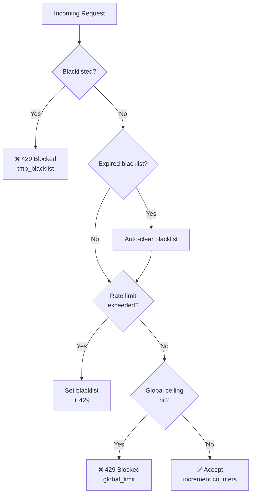

# ChainShield

> Blockchain-inspired DDoS rate limiting for Python web services

[](LICENSE)
[](https://python.org)
[](https://github.com/yourusername/chainshield/actions)
[](https://codecov.io)
[](https://pypi.org/project/chainshield)

---

## What is ChainShield?

Traditional DDoS mitigation relies on centralised CDN services or firewalls that introduce a single point of trust and a single point of failure. Blockchain research has shown that on-chain rate limiting — enforced transparently by smart contracts — offers an alternative model where the rules are immutable, auditable, and not controlled by any single party.

ChainShield brings those same algorithms **off-chain** into Python, where they can protect real services today without gas costs or blockchain latency. It implements the three-layer protection model from the Ethereum smart contract research:

1. **Sliding-window rate limiter** — counts only *recent* requests, avoiding the false-positive trap of cumulative counters.
2. **Temporary blacklist** — blocks offenders for a configurable duration, then auto-expires. No admin intervention needed.
3. **Global request ceiling** — caps the total accepted load across *all* identities, preventing Sybil attacks.

---

## Architecture

```
┌─────────────────────────────────────────────────────────┐
│                       Guardian                          │
│                                                         │
│  Request ──▶ [Blacklist?] ──▶ [Rate limit?] ──▶ [Global?] ──▶ Accept
│                   │                  │               │
│                Block             Block+BL           Block
└─────────────────────────────────────────────────────────┘
                         │
               ┌─────────▼─────────┐
               │   BaseStorage     │
               │  (Memory / Redis) │
               └───────────────────┘
```



---

## Features

- Zero dependencies for core functionality
- Thread-safe in-memory storage out of the box
- Pluggable storage backend (implement `BaseStorage` for Redis, Memcached, etc.)
- First-class Flask and FastAPI middleware
- Configurable per-identity limit, window size, blacklist duration, and global ceiling
- Structured `Decision` object with full context (reason, expiry, window count)
- 90%+ test coverage
- Type-annotated throughout (`mypy --strict` clean)

---

## Installation

```bash
pip install chainshield
```

With Flask support:
```bash
pip install "chainshield[flask]"
```

With FastAPI support:
```bash
pip install "chainshield[fastapi]"
```

---

## Quick Start

```python
from chainshield import Guardian, GuardianConfig

guardian = Guardian(
    GuardianConfig(
        max_requests=5,        # 5 requests per identity
        window_size=60,        # within a 60-second window
        blacklist_duration=30, # offenders blocked for 30 seconds
        global_max_requests=100,
    )
)

decision = guardian.check("192.168.1.1")

if decision.allowed:
    serve_response()
else:
    return 429, decision.block_reason
```

---

## Flask Middleware

```python
from flask import Flask
from chainshield import Guardian, GuardianConfig
from chainshield.middleware import FlaskChainShield

app = Flask(__name__)
guardian = Guardian(GuardianConfig(max_requests=10, window_size=60))
FlaskChainShield(app, guardian)

@app.route("/api/data")
def get_data():
    return {"message": "protected"}
```

Blocked requests automatically receive:
```http
HTTP/1.1 429 Too Many Requests
Retry-After: 28
Content-Type: application/json

{"error": "Too Many Requests", "reason": "rate_limit_exceeded", "retry_after": "28"}
```

---

## FastAPI Middleware

```python
from fastapi import FastAPI
from chainshield import Guardian
from chainshield.middleware import FastAPIChainShield

app = FastAPI()
app.add_middleware(FastAPIChainShield, guardian=Guardian())

@app.get("/api/data")
async def get_data():
    return {"message": "protected"}
```

---

## Behaviour Examples

### Normal traffic — all accepted

```
Request 1  ✓  (in-window: 1)
Request 2  ✓  (in-window: 2)
Request 3  ✓  (in-window: 3)
Request 4  ✓  (in-window: 4)
Request 5  ✓  (in-window: 5)
```

### 6th request — rate limit triggered, blacklist activated

```
Request 6  ✗  reason=rate_limit_exceeded  blacklisted_until=t+30
```

### Subsequent requests while blacklisted

```
Request 7  ✗  reason=temporary_blacklist  retry_after=27s
Request 8  ✗  reason=temporary_blacklist  retry_after=24s
```

### After 30 seconds — automatically unblocked

```
Request 9  ✓  (in-window: 1)   ← fresh window, counter reset
```

### Global ceiling — Sybil traffic blocked

```
user-1 req  ✓  global=1
user-2 req  ✓  global=2
...
user-20 req ✓  global=20
user-21 req ✗  reason=global_limit_exceeded
```

---

## Configuration

| Parameter | Default | Description |
|---|---|---|
| `max_requests` | `5` | Per-identity cap within one window |
| `window_size` | `60` | Window duration in seconds |
| `blacklist_duration` | `30` | Block duration after limit exceeded |
| `global_max_requests` | `20` | Total system-wide cap per window |

---

## Running Tests

```bash
pip install -e ".[dev]"
pytest tests/ --cov=chainshield --cov-report=term-missing
```

---

## Performance

On modern hardware with `MemoryStorage`:

| Workload | Throughput |
|---|---|
| Single identity | ~600,000 checks/sec |
| 1,000 rotating identities | ~350,000 checks/sec |
| Blacklisted identity (fast path) | ~800,000 checks/sec |

---

## Why Python, not Solidity?

The original research demonstrated the algorithm using Ethereum smart contracts. Those contracts suffer from:

- **Gas cost**: every state change costs real money
- **Block latency**: 12-second block times make real-time filtering impossible
- **Revert bug**: Solidity's `revert` rolls back the blacklist state — the basic contract never actually persisted its blacklist
- **Network dependency**: contract calls require an Ethereum node

ChainShield takes the same algorithm and runs it at microsecond latency with zero transaction cost. The trade-off is that it requires a trust anchor (your server), which is acceptable for most real-world deployments. For use cases that genuinely require decentralised, trustless enforcement, use the Solidity enhanced contract as a policy registry and query it from an off-chain gateway.

---

## Security Considerations

See [docs/Security-Analysis.md](docs/Security-Analysis.md) for a full threat model. Key points:

- Sybil attacks are mitigated by the global ceiling, not fully prevented
- Use a trusted reverse proxy to prevent `X-Forwarded-For` spoofing
- For multi-process deployments, implement Redis-backed storage
- The temporary blacklist is intentionally not permanent — tune `blacklist_duration` to your threat model

---

## Roadmap

- [ ] Redis storage backend
- [ ] Token bucket algorithm as an alternative to sliding window
- [ ] Django middleware
- [ ] Prometheus metrics exporter
- [ ] Async-native Guardian for `asyncio` applications
- [ ] IP range (CIDR) blocking support
- [ ] CLI tool for inspecting live state

---

## Contributing

See [CONTRIBUTING.md](CONTRIBUTING.md). All contributions are welcome.

---

## License

MIT — see [LICENSE](LICENSE).
