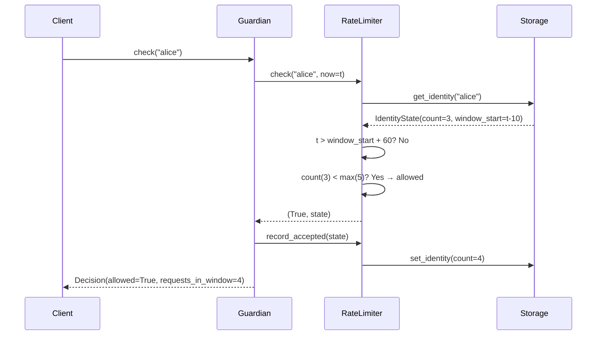

# Sliding Window Rate Limiting

## Problem with Cumulative Counters

The original "basic contract" from the Solidity implementation used a cumulative counter that never reset. This creates a well-known false-positive problem:

- A user sends 5 requests spread over 3 months → blocked forever
- A user sends 5 requests in 1 second → same treatment

A legitimate long-term user eventually hits the cap. The sliding window fixes this.

## Algorithm

For each identity, track `(request_count, window_start)`.

On every incoming request:

```
now = current_time()

if now > window_start + window_size:
    # Window expired — start fresh
    window_start = now
    request_count = 0

if request_count >= max_requests:
    return BLOCKED  # and trigger temporary blacklist

request_count += 1
return ALLOWED
```

## Sequence Diagram



## Parameters

| Parameter | Default | Meaning |
|---|---|---|
| `max_requests` | 5 | Max requests per identity per window |
| `window_size` | 60 | Window duration in seconds |

## Advantages over Cumulative Counter

| Property | Cumulative | Sliding Window |
|---|---|---|
| Resets over time | No | Yes |
| False-positive rate | High | Low |
| Honest long-term users blocked | Yes | No |
| Implementation complexity | O(1) | O(1) |

## Boundary Behaviour

The window resets when `now > window_start + window_size` (strictly greater than). A request at *exactly* the boundary still belongs to the current window. This matches standard token-bucket semantics.
